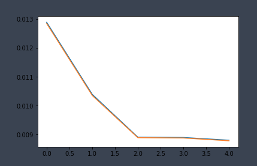
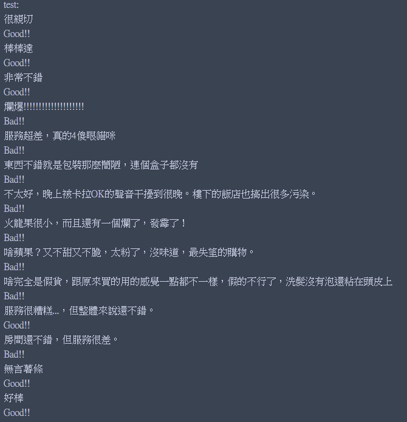
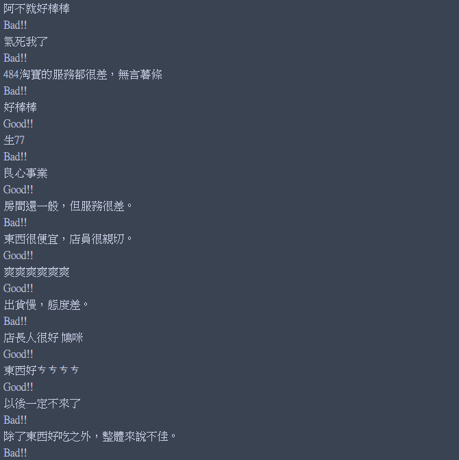
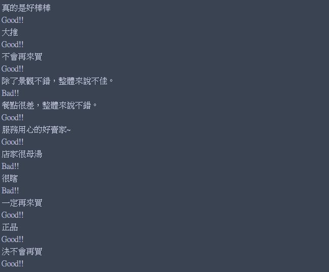

# 情感分析

## 語料 ##

語料1為[譚松波教授整理的中文情感挖掘語料-ChnSentiCorp](http://www.nlpir.org/wordpress/2017/09/04/%E4%B8%AD%E6%96%87%E6%83%85%E6%84%9F%E6%8C%96%E6%8E%98%E8%AF%AD%E6%96%99-chnsenticorp/)

說明：譚松波收集整理了一個較大規模的酒店評論語料語料規模為10000篇語料從攜程網上自動採集，並經過整理而成。

語料2為[手機購買評論正負情感語料](http://www.unopencity.com/index/)

說明：共正負各5000筆。

語料3為[水果購買評論正負情感語料](http://www.unopencity.com/index/)

說明：共正負各1000筆。

語料4為[洗髮精購買評論正負情感語料](http://www.unopencity.com/index/)

說明：共正負各1000筆。

## train_word2vec

使用word2vec訓練其他語料(這邊有使用wiki百科、其他網路上蒐集的中文語料)，維度為300維。

## preprocessing ##

使用ChnSentiCorp正負各3000筆資料，合併句子、移除重複句子、簡轉繁(opencc)、分詞(jieba)、刪除長度大於30個詞的句子、打亂順序(Shuffle)、負正各取3000筆合併。

sentiment_2_daat:格式為負評3000筆,正評3000筆共6000筆，以'\n'隔開，每筆資料格式為長度小於等於30的字,以' '隔開。

sentiment_2_daat轉成list後依word2vec模型轉換成vec，存成shape=(6000,30,300)的矩陣，作為feature。另外創建shape=(6000)的矩陣，前3000筆為0、後3000筆為1，作為label。

## sentiment_analysis ##

4層LSTM、1層affine(linear)、1層affine(linear)+relu、輸出層softmax、使用MSEloss(沒有用Cross_entropy)、hidden_number=100，batch=400，epoch=200。

